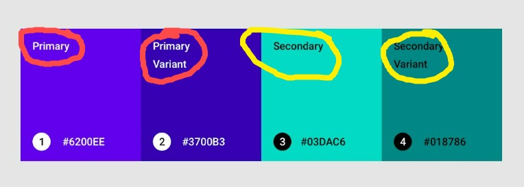

# Color System Guide

This style guide is created from Material.io design guidelines
If you want to learn from animations and illustrations, [follow this link](https://material.io/design/color/the-color-system.html#color-theme-creation)

Following given are the types of colors that we using across our WebApp.

1. **background color** - background color for pages/screens. this color DOES NOT represent brand.

2. **surface/paper color** - background color for elements containing content, such as cards. this color DOES NOT represent brand. cards are generally elevated surfaces/layer. they look like they have some height.

3. **placeholder/disabled text color** - its used as disabled text color/ low-emphasis text color

4. **primary color** - primary color, usually your brand color. _Used frequently_ in components and app's screen.

5. **Accent/Secondary color** - secondary color for your app which complements the primary color. _Used sparingly_.
   Secondary colors are used for: Floating action buttons, Links and headings (not regular text for paragraphs. For headings n other large fonts), Selection controls, like sliders and switches, Highlighting selected text

   _(Both of these primary and secondary colors mainly represent your brand)_

6. **primary text color** - its general text on buttons and paragraphs and small font text only

7. **secondary text color** - its used an complementary text color with **text color**

#### Key Takeaways

<figure>

<figcaption align = "center">Fig 1: <b>Primary & Secondary Color Variants</b></figcaption>
</figure>

In Fig 1,

- Red marked texts have **primary _text_ color** which is `#ffffff`
- Yellow marked texts have **secondary _text_ color** which is `#000000`
- Red marked palettes show two **primary colors** which are `#6200EE` and its variant `#3700B3`
- Yellow marked palettes show two **secondary colors** which are `#03DAC6` and its variant `#018786`
- **Note that**:
  - There are two different types in color: fill colors and text colors
    - There are 4 fill colors (primary, primary variant, secondary, secondary varaint) and 2 text colors (primary, secondary)
  - There primary text color is only used upon primary color fill and primary variant fill. Similarly, there seconndary text color is only used upon secondary color fill and secodnary variant fill.
  - Currently, in our project we are not using any fill variant colors. But, it is subject to change in future.
