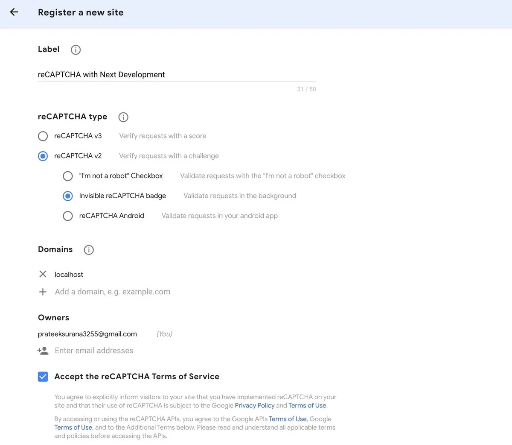
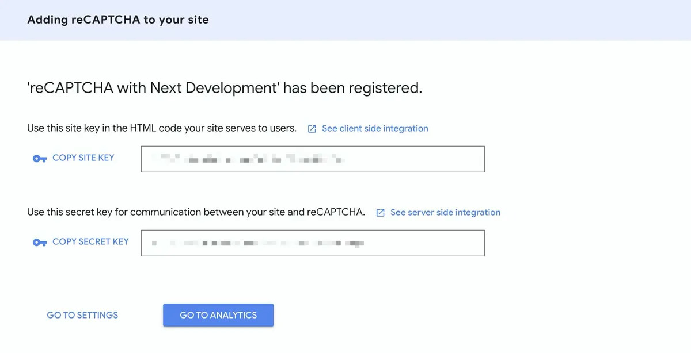
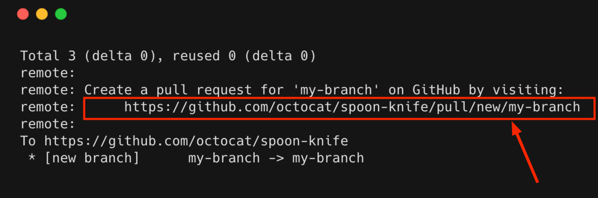
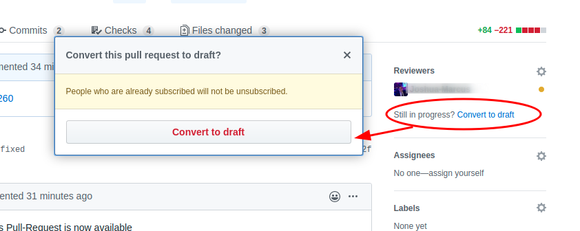

# Contributing Guidelines

This documentation contains a set of guidelines to help you during the contribution process.

We are happy to welcome contributions from anyone willing to add to or improve this project. Thank you for helping out and remember, **no contribution is too small.**

- Each contributor can be assigned **2 issues (max)** at a time to work on.
- Contributors are expected to follow [project guidelines and coding style](PROJECT-GUIDELINES.md). Structured code is one of our top priorities.
- Contributors must **comment** on the "open issue" they would like to work on, and wait to be assigned by a maintainer.
- Issues will be assigned on a **first-come, first-serve basis**.
- Contributors may also **open their own issues** and assign themselves if they want to work on them.
  - ##### Make sure to follow these when opening issues:
    - Your issue title must be in the form of `ISSUE_TYPE: ISSUE_TITLE`
      - ISSUE_TYPE can be `feat` (issues for new features), `bug`(for bug), `docs` (for docs), `chore`(for miscellaneous)
      - ISSUE_TITLE must be clear and concise.
    - Make sure to give sufficient context in your issue description.
    - Wherever applicable, add reference links or screenshots.
    - If you are going to work on it yourself, mention that in the issue. You will be assigned by a maintainer.
- Before opening a new issue, please **check** that it hasn't already been created.
- Pull requests will be merged after being **reviewed by a maintainer**.
- Create a pull request from a **new branch** other than `dev`.
- Create **a new branch** from a freshly updated `dev` branch only. Do NOT create new branches from the `main` branch.
- It might take a day to review your pull request. Please have patience and be nice.
- We all are here to learn. You are allowed to make mistakes. That's how you learn, right!

- **MAKE SURE TO OPEN A DRAFT PR AS SOON AS YOU START WORKING ON AN ISSUE AND KEEP COMMITTING TO IT SO THAT WE CAN KNOW THAT YOU ARE WORKING ON THAT PARTICULAR ISSUE** (see [Converting Existing PR to Draft PR](#converting-existing-pr-to-draft-pr))
- Contributors have **5 days** to complete issues. If you think you will need more time, make sure to update your Draft Pull Request regularly by committing any changes you have made so far. This will help maintainers track your progress and assist you with your PRs more effectively. We want you to succeed in merging your PRs. We want to make sure that you learn open source in an effective way.

- ##### Pull request review criteria:

  - Your PR title must be in the form of `PR_TYPE: PR_TITLE`
    - eg, `feat: new funky section`, `fix: fix the fencepost error`, `docs: add link to discord`, `style: make header component responsive`, `chore: add walkingpal logo`
    - Refer [Git Commit Guidelines](./GIT-GUIDELINES.MD) for more details
  - Make sure you have created an issue for your PR. [Link that issue to your PR](https://docs.github.com/en/issues/tracking-your-work-with-issues/linking-a-pull-request-to-an-issue).
  - Mention your proposed changes in the PR description along with screenshots and reference links (if applicable).
  - If you created new files, make sure they follow [Project Structure Guidelines](./PROJECT-STRUCTURE.md).
  - Your work must be **original**, written by you, not copied from other resources. Copying is not bad. But copying without properly understanding which parts of the code are needed and which are not is very bad. Make sure you avoid adding redundant code.
  - You must **comment** on your code wherever necessary. **Avoid committing commented code**, e.g `console.log` statements, etc.
  - For **frontend changes** kindly share screenshots and samples of your work before sending a PR.
  - For **frontend changes**, abide by the [STYLE GUIDE](./STYLE-GUIDE.md).
  - ⚠**IMPORTANT**⚠ After creating your PR, Vercel will try to automatically deploy your PR code. If your Vercel build fails in your PR, you need to run `yarn build` locally and address those build errors. Your PR won't be reviewed until after the build errors have been fixed. It would be considered a WIP draft PR.

- For any queries or discussions, see [Asking for help](#asking-for-help)

# Get started on your first PR👩‍💻👨‍💻

## Development environment setup

Begin by following these steps to set up your development environment.

### Install tools

The following tools should be installed and running on your computer:

- [GIT](https://git-scm.com/)
- [Node.js](https://nodejs.org/) (latest LTS version)
  - Install **Yarn** using `npm install --global yarn`

### Setup Git

1. Make sure that you personalize your GIT by setting your username and email for commits:

   ```sh
   git config --global user.name "John Doe"
   git config --global user.email johndoe@example.com
   ```

   :warning: Make sure to configure the same email as registered in your GitHub account. [See here also](https://git-scm.com/book/en/v2/Getting-Started-First-Time-Git-Setup)

2. Please refer to our [Branching Strategy](http://scenarioo.org/docs/develop/contribute/Branching-strategy.html) for more information about how we use branches and create releases. (**TL;DR**: When contributing a new feature or a bugfix, **always create a new branch from the `dev` branch** before you begin working.)

### Get the Sources

1. [Fork the WalkingPal/walking-pal-web repository](https://github.com/WalkingPal/walking-pal-web/fork).
2. Clone your forked `<ur-github-username>/walking-pal-web` repository
   ```sh
   git clone https://github.com/<ur-github-username>/walking-pal-web.git
   cd walking-pal-web
   ```
3. Add our upstream [WalkingPal/walking-pal-web](https://github.com/WalkingPal/walking-pal-web.git) repository with the label `upstream`
   ```sh
   git remote add upstream https://github.com/WalkingPal/walking-pal-web.git
   ```
4. Checkout to the `dev` branch and set up your local `dev` branch to track changes from `upstream/dev`
   ```sh
   git checkout dev
   git branch --set-upstream-to upstream/dev
   ```
5. Install all project dependencies
   ```sh
   yarn install
   ```

### Additional Setup

The WalkingPal app utilizes reCAPTCHA to enhance security and prevent spammers/bots from polluting our database.
To access the `/register` and `/faq` pages on the app seamlessly, follow the required steps:

1. Head to the [reCAPTCHA admin console](https://www.google.com/recaptcha/admin/create) and fill in the required details.



2. After clicking submit, you should be able to see the public and secret keys.



3. Create a file called .env.local and add the following to it. Then paste the keys you copied from the reCAPTCHA dashboard appropriately.

```bash
# Add the public site key here
NEXT_PUBLIC_RECAPTCHA_SITE_KEY=
# Add the secret key here
RECAPTCHA_SECRET_KEY=
```

## Run Next.js development server

```bash
yarn dev
```

Open [http://localhost:3000](http://localhost:3000) with your browser to see the result.

You can start editing and modifying [home page](../pages/home/Home.tsx). The page auto-updates as you edit the file.

[API routes](https://nextjs.org/docs/api-routes/introduction) can be accessed on [http://localhost:3000/api/](http://localhost:3000/api/). This endpoint can be edited in [pages/api/index.pg.ts](../pages/api/index.pg.ts).

The `pages/api` directory is mapped to `/api/*` route. Files in this directory are treated as [API routes](https://nextjs.org/docs/api-routes/introduction) instead of React pages.

### Learn more

To learn more about Next.js, take a look at the following resources:

- [Next.js Documentation](https://nextjs.org/docs) - learn about Next.js features and API.
- [Learn Next.js](https://nextjs.org/learn) - an interactive Next.js tutorial.

# Contributing Workflow

## Find an issue 🔍

- Take a look at the existing issues or [create your own](https://github.com/WalkingPal/walking-pal-web/issues/new/choose)!
- Wait for the issue to be assigned to you.
- Note: Every change in this project must have an associated issue.
- After being assigned, you can start working on your Pull Request.

## Start working on your Pull Request

1. Before you begin working on a new feature or bugfix, always first checkout the dev branch and update the dev branch
   ```sh
   git checkout dev
   git pull #this command will pull changes from upstream/dev as we previously configured our dev branch to track from upstream/dev
   ```
2. Create a new branch. We use [Branching Strategy](http://scenarioo.org/docs/develop/contribute/Branching-strategy.html) to create new branches.
   **Example:** Suppose you are going to start working on a bugfix that fixes a button's onClick behaviour. Create a branch name like: `fix/button-onclick`. Checkout the new branch and start working on your bugfix.
   ```sh
    git checkout -b fix/button-onclick
    # Now start working on your bugfix
   ```
3. After finishing the bugfix, stage all your changes using the `git add` command.
4. Commit all those changes with a nice commit message that follows [our commit message guidelines](./GIT-GUIDELINES.MD).

   - If you get an error from husky commit-msg hook after running `git commit` command, this means that your commit message does not follow the commit guidelines. Correct your commit message.

5. Push the changes to your forked repository
   ```sh
   git push origin <your-branch-name> #in our example the branch name is "fix/button-onclick"
   ```
6. After pushing you will see a create pull request link as shown in the figure shown below:
   
   Create your Pull Request using that link 🎉

## Converting existing PR to draft PR

If your Pull Request is a work in progress: go to your Pull Request and click on `Convert to draft` to convert it to a Draft PR.


## Making changes to an existing PR

Sometimes maintainers may request changes in your PR. It is advised NOT to close the existing PR to create a new one. Instead, push changes to the existing PR branch. The PR will get automatically updated with your latest changes.

## Asking for help

[Join our discord server](https://discord.gg/Et3aQTsW6a) to meet WalkingPal's amazing community.

> Make sure to read and follow the instructions in the `#🚦start-here` channel after joining the Discord server.

Ask your questions in the `#💬devs-general` channel.

That's all! Happy Contributing!!
