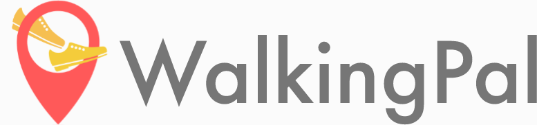
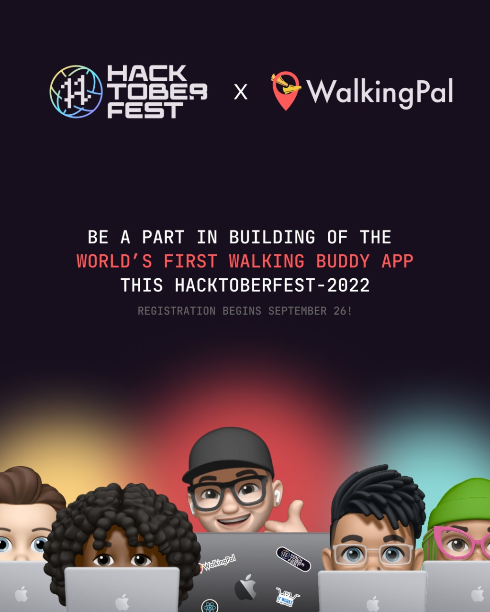

# WalkingPal

WalkingPal is the world's first walking buddy app of its kind. Get yourself a walking buddy anytime and anywhere in just a few clicks! Visit [walkingpal.in](https://walkingpal.in/) to know more about us!

### Community 👥

> Make sure you read and follow the instructions in `#🚦start-here` channel after you join the Discord server.

Make sure you read and follow the [code of conduct](./.docs/CODE-OF-CONDUCT.md)

---

## walking-pal-web Project

This is the official repo for the [WalkingPal website](https://walkingpal.in/).

&nbsp;

#### Tech Stack Used: 💻

     

---

## Contributing Guidelines🤝🏽🍀:

**Wish to fix a bug or add a new feature?**
Checkout our [contributing guidelines](.docs/CONTRIBUTING.md)!

---

## WalkingPal is participating in Hacktoberfest'22 🎉〽🥳

Contribute to any of our [repositories](https://github.com/WalkingPal) and get you Pull Requests accepted between October 1 and October 31 to count your Pull Request towards you hacktoberfest contributions! We strictly abide by Hacktoberfest Rules and Guidelines. [Checkout Participation Guidelines](https://hacktoberfest.com/participation/)

---

## The geeks🤓 behind this initiative:

#### Project Maintainer👨‍🏫:

[@ashuvssut](https://github.com/ashuvssut)

#### Our valuable Contributors👩‍💻👨‍💻

